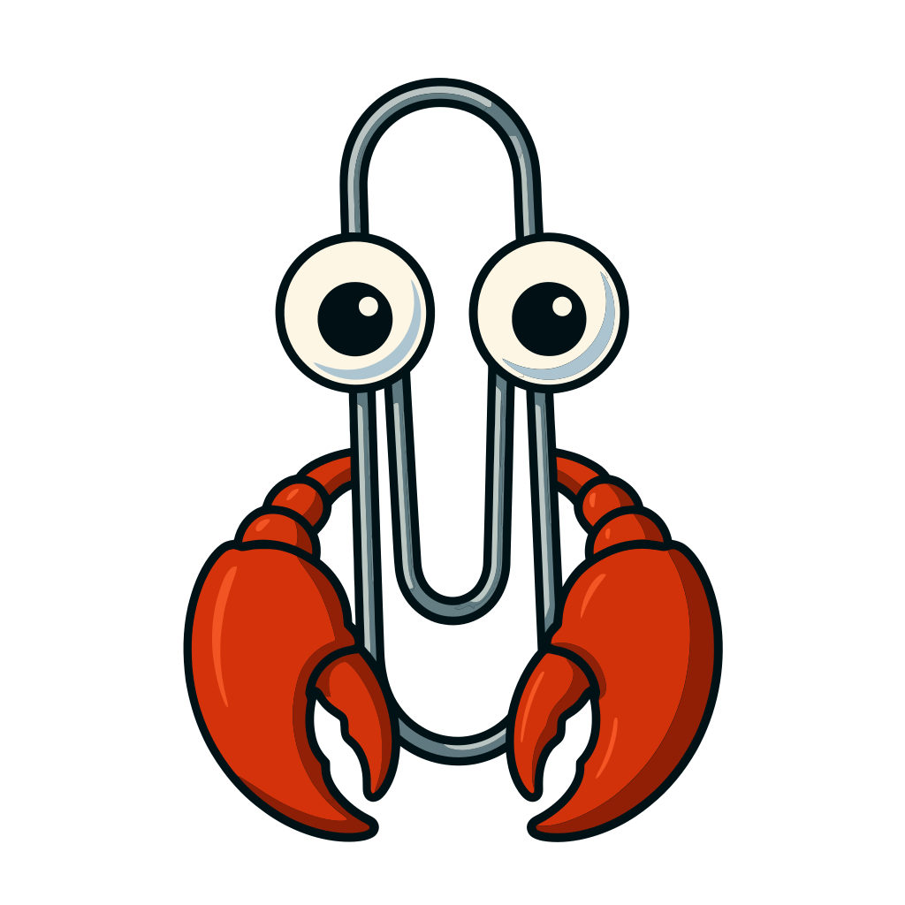

<p align="center">
  
</p>

<h1 align="center">OpenClippy</h1>

<p align="center">
  <strong>Your autonomous AI work agent for Microsoft 365.</strong><br>
  61 tools. 10 services. 4 permission levels. One agent that respects your security boundaries.
</p>

<p align="center">
  <a href="#quick-start">Quick Start</a> &bull;
  <a href="#features">Features</a> &bull;
  <a href="#tool-profiles">Tool Profiles</a> &bull;
  <a href="#architecture">Architecture</a> &bull;
  <a href="#contributing">Contributing</a>
</p>

<p align="center">
  
  
  
  
  
</p>

---

## What Is OpenClippy?

OpenClippy connects to your Microsoft 365 account via the Graph API and manages your email, calendar, tasks, Teams, files, and more through natural language. Ask it to triage your inbox, schedule meetings, create tasks from emails, search across your OneDrive — all from the terminal.

```bash
openclippy ask "What are my unread emails from my manager this week?"
openclippy ask "Schedule a 30-minute meeting with the design team next Tuesday at 2pm"
openclippy ask "Find all files in OneDrive related to the Q1 budget"
```

### Why OpenClippy?

AI agents that manage your Microsoft 365 are powerful — but they need guardrails. OpenClippy was built with a few principles that set it apart:

- **Focused scope.** 10 M365 services with 61 well-defined tools. Not an everything-agent — a purpose-built M365 agent.
- **Granular permissions.** 4 tool profiles from `read-only` (can't change anything) to `admin` (org-wide ops). You decide what the agent can do.
- **No stored secrets.** Device code auth via MSAL — your credentials stay with Microsoft, not in a config file.
- **Auditable codebase.** TypeScript (strict mode), clean module boundaries, MIT licensed. Read every line if you want.
- **Extensible.** Plugin system for custom service integrations. Drop an ESM module in `~/.openclippy/plugins/` and go.

---

## Quick Start

```bash
# Install
pnpm install

# Configure Azure AD credentials
mkdir -p ~/.openclippy
cat > ~/.openclippy/config.yaml << 'EOF'
azure:
  clientId: "your-application-client-id"
  tenantId: "common"
EOF

# Authenticate
openclippy login

# Ask a question
openclippy ask "What are my unread emails?"

# Or start an interactive chat
openclippy chat
```

See [docs/setup.md](docs/setup.md) for the full Azure AD app registration walkthrough.

---

## Features

OpenClippy provides **61 tools** across **10 Microsoft 365 services**:

| Service | What It Does |
|---------|-------------|
| **Outlook Mail** | List, read, search, send, reply, forward, flag, move, delete emails |
| **Outlook Calendar** | View, create, update, delete events; accept/decline invites; check free/busy |
| **To Do** | Manage task lists; create, update, complete, delete tasks |
| **Teams Chat** | Read and send messages in chats and channels |
| **OneDrive** | Browse, read, search, upload, delete, and share files |
| **People & Contacts** | Search for relevant people and browse Outlook contacts |
| **Presence** | Read Teams availability; set and clear presence overrides |
| **Planner** | View plans, tasks, and buckets; create and update Planner tasks |
| **OneNote** | Browse notebooks and sections; read and create pages |
| **SharePoint** | Search sites; browse lists, items, and document libraries |

Enable only what you need — OpenClippy requests Graph API scopes only for enabled services.

---

## Tool Profiles

This is the core of OpenClippy's security model. Tool profiles control which operations the agent can perform, so you're never wondering what it might do:

| Profile | Allowed Operations | Use Case |
|---------|-------------------|----------|
| **read-only** | List, read, search, free/busy | Safe browsing — no changes to your data |
| **standard** | Read-only + create, update, draft, flag, move, reply, forward | Day-to-day work (default) |
| **full** | Standard + send, delete, share, upload | Full autonomy including destructive operations |
| **admin** | Full + organization-wide operations | IT admin scenarios |

Set your comfort level in config:

```yaml
agent:
  toolProfile: "standard"  # read-only | standard | full | admin
```

Start with `read-only` to explore safely. Move to `standard` when you're comfortable. You're always in control.

---

## Configuration

OpenClippy reads its configuration from `~/.openclippy/config.yaml`:

```yaml
azure:
  clientId: "your-application-client-id"
  tenantId: "common"

services:
  mail: { enabled: true }
  calendar: { enabled: true }
  todo: { enabled: true }
  teams-chat: { enabled: true }
  onedrive: { enabled: true }
  planner: { enabled: false }
  onenote: { enabled: false }
  sharepoint: { enabled: false }
  people: { enabled: true }
  presence: { enabled: true }

agent:
  model: "claude-sonnet-4-5-20250514"
  toolProfile: "standard"
  identity:
    name: "Clippy"
```

---

## CLI Commands

| Command | Description |
|---------|-------------|
| `openclippy login` | Authenticate with your Microsoft account (device code flow) |
| `openclippy ask "..."` | One-shot query to the agent |
| `openclippy chat` | Interactive terminal chat session |
| `openclippy status` | Check auth and service status |
| `openclippy services` | List services and their scopes |
| `openclippy config` | Show or edit configuration |
| `openclippy gateway start` | Start the long-running gateway daemon |
| `openclippy gateway stop` | Stop the gateway |
| `openclippy gateway status` | Check gateway status |

---

## Plugins

Extend OpenClippy with custom service integrations. Plugins are ESM modules loaded from `~/.openclippy/plugins/` and configured via your `config.yaml`:

```yaml
plugins:
  my-service:
    enabled: true
```

See the [Plugin Authoring Guide](docs/plugin-authoring.md) for the full reference, or check out the [example plugin](examples/example-plugin/).

---

## Architecture

```
CLI / TUI / Teams Bot
        |
   Gateway (WebSocket + HTTP)
        |
   Agent Runtime (Claude LLM + tool dispatch)
        |
   Service Modules (Mail, Calendar, ToDo, ...)
        |
   Graph API Client (typed fetch, pagination, batching)
        |
   Microsoft Graph API
```

- **Auth:** MSAL device code flow (public client, no secret required)
- **Graph client:** Custom fetch-based client — lean and typed, not the heavy `@microsoft/microsoft-graph-client`
- **Gateway:** Long-running daemon with WebSocket (for CLI/TUI clients) and HTTP (for Graph change notifications and Teams bot webhooks)
- **Subscriptions:** Mail and Calendar support Graph change notifications for real-time updates
- **Service modules:** Each M365 service implements a clean `ServiceModule` interface — capabilities, tools, optional health probes, optional subscriptions

---

## Tech Stack

- TypeScript (strict, ESM), Node.js 22+
- pnpm package manager
- @azure/msal-node for authentication
- @anthropic-ai/sdk for agent LLM (Claude)
- Commander.js for CLI
- better-sqlite3 for memory and sessions
- ws for WebSocket gateway
- vitest for testing, tsdown for building

---

## Documentation

- [Azure AD Setup Guide](docs/setup.md) — Register your app and configure permissions
- [Service Reference](docs/services.md) — All 10 services with capabilities, scopes, and tools
- [Tool Reference](docs/tools.md) — Detailed reference for all 61 tools with parameters
- [Plugin Authoring Guide](docs/plugin-authoring.md) — Build custom service integrations

---

## Contributing

OpenClippy is early-stage and contributions are welcome! Here are some ways to get involved:

- **Try it out** and [open an issue](https://github.com/revsmoke/openclippy/issues) with bugs or feedback
- **Add a service** — the `ServiceModule` interface makes it straightforward to add new Graph API integrations
- **Write tests** — more coverage is always appreciated
- **Improve docs** — especially setup guides and real-world usage examples
- **Build a plugin** — and share it with the community

Check out the issues labeled [`good first issue`](https://github.com/revsmoke/openclippy/issues?q=is%3Aissue+is%3Aopen+label%3A%22good+first+issue%22) for entry points.

---

## Requirements

- Node.js >= 22.12.0
- A Microsoft 365 account (work/school or personal)
- An Azure AD app registration ([setup guide](docs/setup.md))

## Development

```bash
pnpm install          # Install dependencies
pnpm build            # Build with tsdown
pnpm test             # Run tests with vitest
pnpm dev              # Run in dev mode with tsx
pnpm lint             # Lint with oxlint
pnpm typecheck        # Type-check with tsc
```

---

## About the Name

Yes, it's a [Clippy](https://en.wikipedia.org/wiki/Office_Assistant) reference. No, it won't ask if you need help writing a letter. (Unless you ask it to.)

## License

MIT
